# Kitchen Theme Book: Design Showcase & Recipe Explorer

A recipe site built as a front-end design playground, demonstrating four distinct UI templates over a shared JSON recipe database and reusable JavaScript components.

## Project Overview

This project is a recipe book site with four visual designs:
- **Editorial**
- **Brutalist**
- **Organic**
- **Retro**

Each style is implemented as a separate template under `designs/`, while the core logic and recipe database remain shared.

## Preview

### Main entry and style gallery

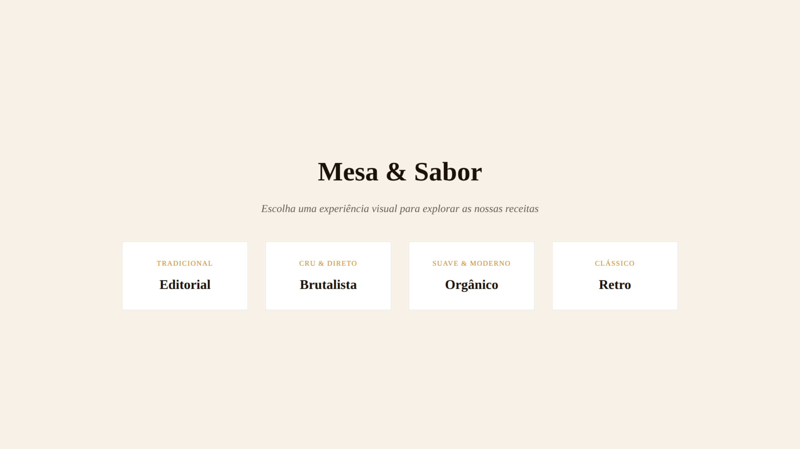

### Design previews

- **Editorial**
  - 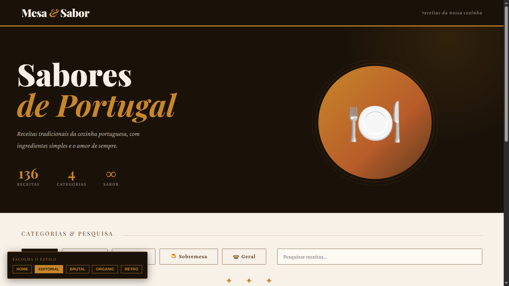
  - 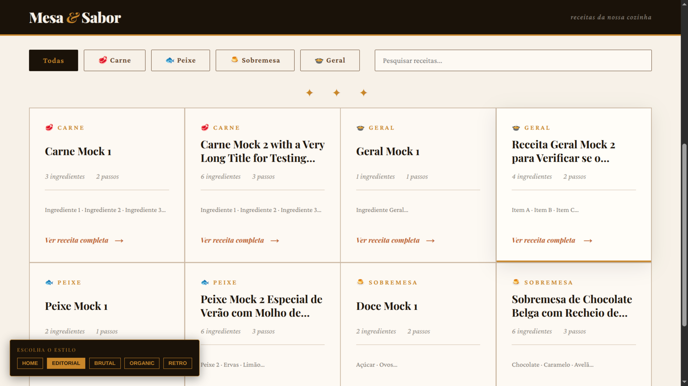
  - 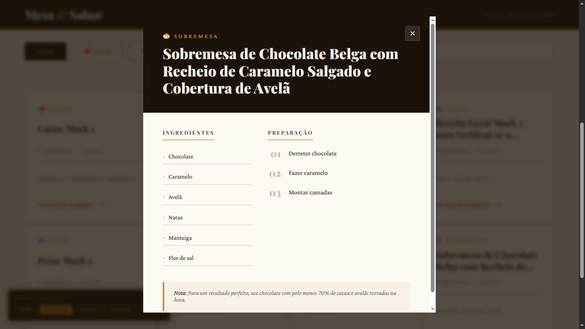
- **Brutalist**
  - 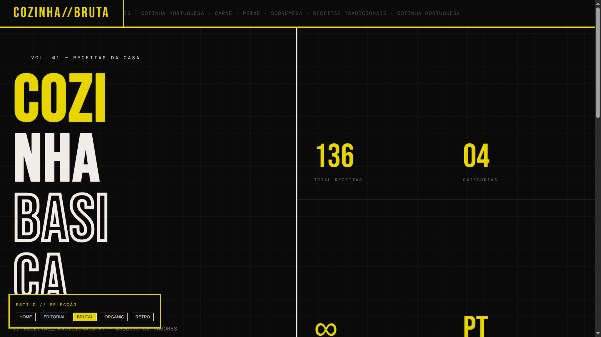
  - 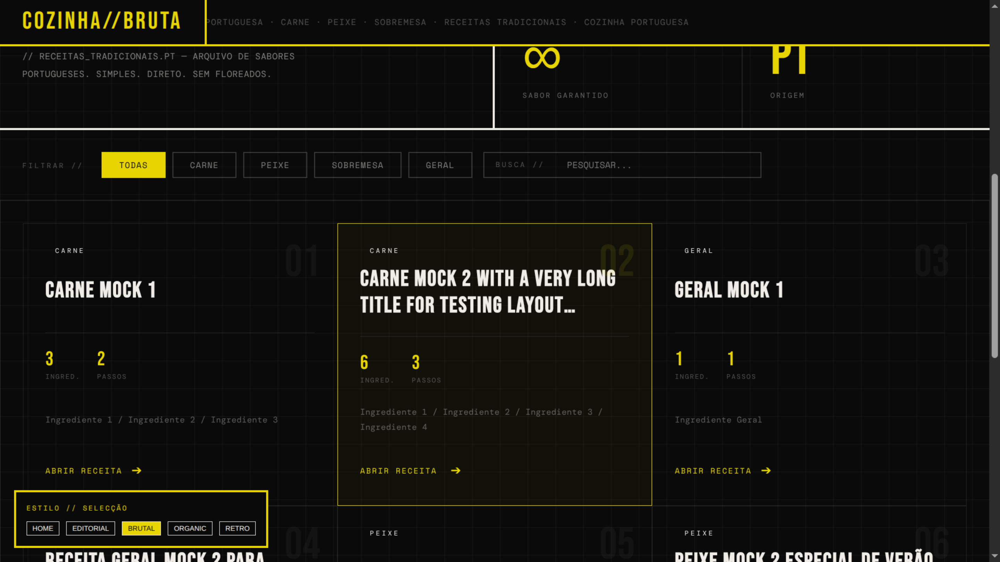
  - 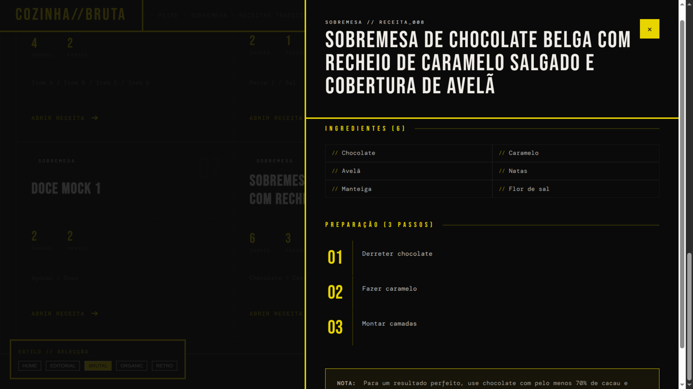
- **Organic**
  - 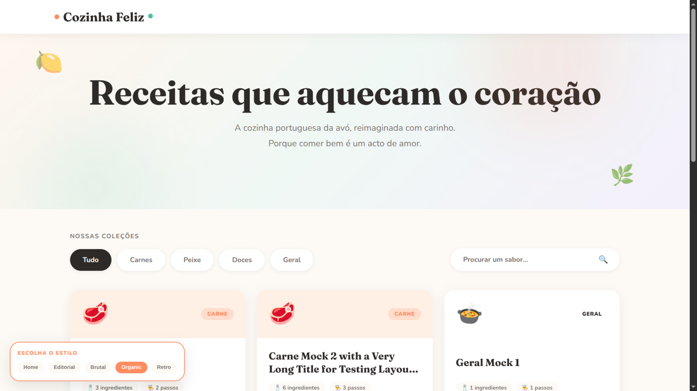
  - 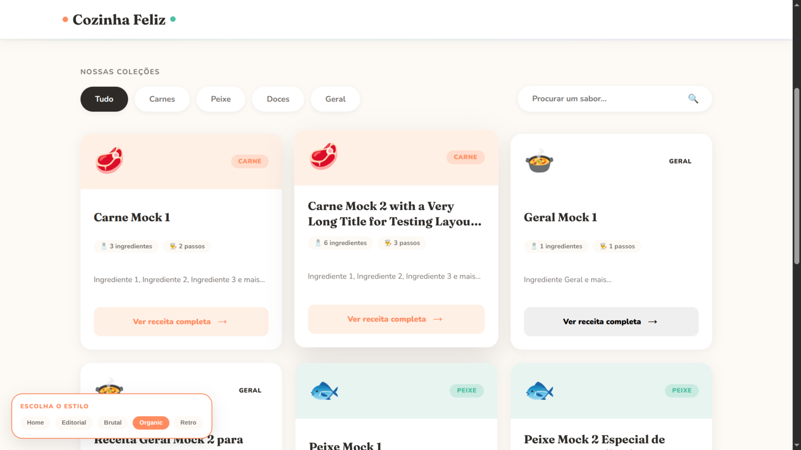
  - 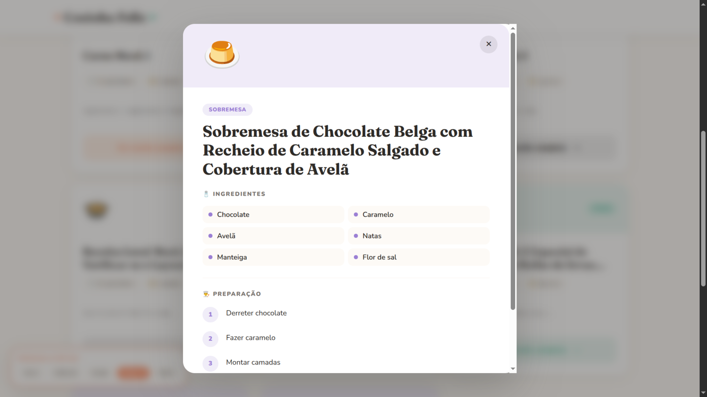
- **Retro**
  - 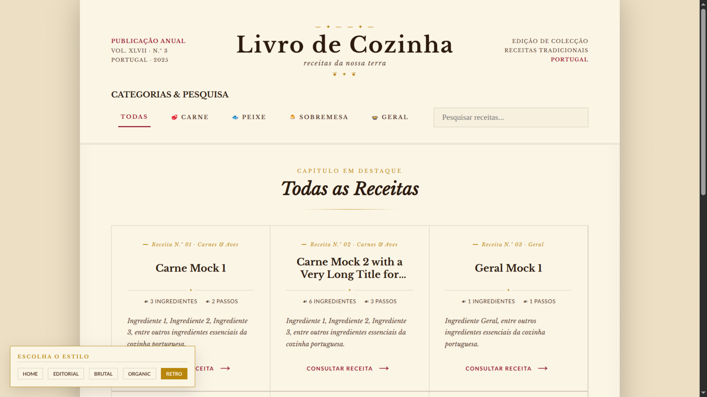
  - 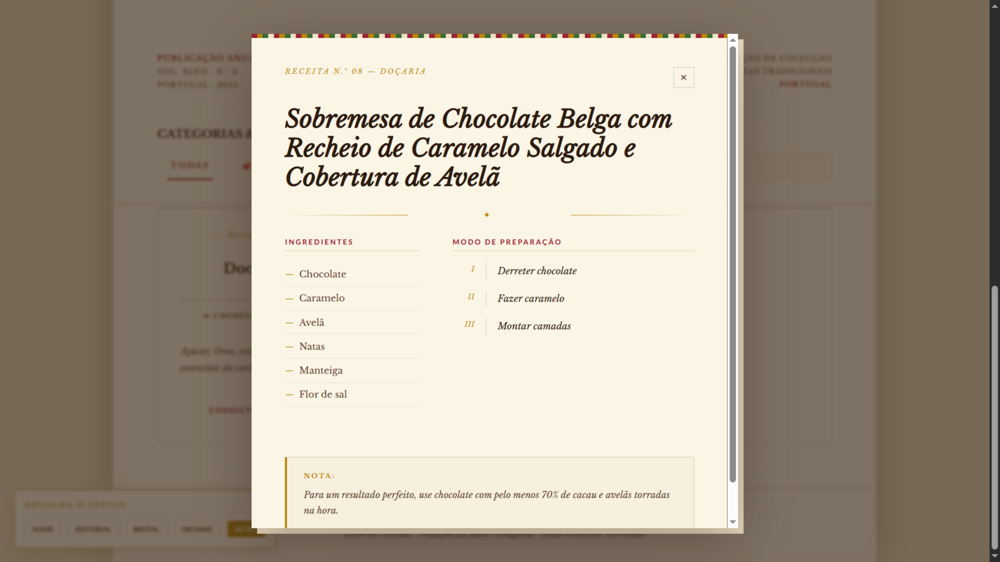

## What’s Included

- `database/`: JSON recipe data organized by category.
- `database/index.json`: Auto-generated index of all recipe JSON files.
- `designs/`: Four style-specific UI templates.
- `scripts/`: Shared application logic and automation utilities.
- `index.html`: Default entry point for the site.
- `styles.css`: Base styles and shared layout rules.

## Project Structure

- `database/`
  - `carne/`: Beef and meat recipe JSON files.
  - `peixe/`: Fish recipe JSON files.
  - `sobremesa/`: Dessert recipe JSON files.
  - `index.json`: Generated list of all database files.
- `designs/`
  - `brutalist/`
  - `editorial/`
  - `organic/`
  - `retro/`
- `scripts/`
  - `core.js`: Shared page logic, state management, and filtering.
  - `StyleSwitcher.js`: Theme switcher component.
  - `FilterBar.js`: Recipe search and filter UI logic.
  - `RecipeCard.js`: Recipe card rendering.
  - `RecipeModal.js`: Recipe modal behavior.
  - `AppHeader.js`, `AppFooter.js`: Shared page structure components.
  - `update-index.js`: Generates `database/index.json` from the JSON source files.

## Features

- Shared recipe data across multiple style templates.
- Local JSON database with category-based recipe files.
- Search and filtering from a single core logic implementation.
- Four different UI looks to compare design approaches.
- A lightweight automation script to keep the recipe index up to date.

## Usage

1. Update the recipe index from the database:

```bash
node scripts/update-index.js
```

2. Open `index.html` in a browser, or open any style-specific template under `designs/`.

## Notes

- The site is built without front-end frameworks, using modular JavaScript and HTML templates.
- `index.html` can be used as the main entry point, while `designs/editorial/index.html` provides a dedicated editorial view.
- The current setup is ideal for testing UI variations and validating a shared recipe data model.
